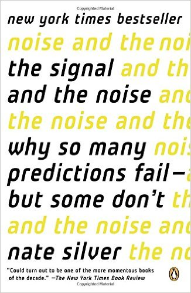

# Reading List
A collection of references that all programmers should read.

## General Reading:

* The Signal and The Noise (by Nate Silver)
 
| Cover   |      Description      |
|----------|:-------------:|
|  |  People love statistics. Statistics, however, do not always love them back. The Signal and the Noise, Nate Silver's brilliant and elegant tour of the modern science-slash-art of forecasting, shows what happens when Big Data meets human nature. Baseball, weather forecasting, earthquake prediction, economics, and polling: In all of these areas, Silver finds predictions gone bad thanks to biases, vested interests, and overconfidence. But he also shows where sophisticated forecasters have gotten it right (and occasionally been ignored to boot). In today's metrics-saturated world, Silver's book is a timely and readable reminder that statistics are only as good as the people who wield them. |
* The End of Power
    * by Moises Naim
* THINK: A Biography of the Watsons and IBM
    * by William Rodgers (originally printed 1969)

## Language References:

* Programming in C: A complete introduction to the C programming language
    * by Stephen G. Kochan (originally printed 2005)
* Microsoft Visual C# Step by Step: Eighth Edition
    * by John Sharp (originally printed 2015)

## Egoless / General Programming:

* The Psychology of Computer Programming
    * by Gerald M. Weinberg (originally printed 1971)
* An Introduction to General Systems Thinking
    * by Gerald M. Weinberg (originally printed 1975)

## General Software Engineering:

* The Mythical Man-Month: Essays on Software Engineering
    * by Frederick P. Brooks, Jr. (originally printed 1975)
* Strategic Planning for Technology Industries
    * by Philip M. Sherman (originally printed 1982)

## Design Patterns:

* Design Patterns Explained: A New Perspective on Object Oriented Design
    * by Alan Shalloway and James R. Trott
* Design Patterns: Elements of Reusable Object-Oriented Software *(Gang of Four Book)*
    * by Erich Gamma, Richard Helm, Ralph Johnson, John Vlissides

## Operating Systems Design / UNIX:

* Operating System Design: The XINU Approach
    * by Douglas Comer (originally printed 1984)
* The Design of the UNIX Operating System
    * by Maurice J. Bach (originally printed 1986)

## Databases / Database Management:

* Principles of Data-base Management
    * by James Martin (originally printed 1976)

## Algorithms:

* Algorithms in C
    * by Robert Sedgewick
* Introduction to Algorithms
    * by Thomas H. Cormen, Charles E. Leiserson, Ronald L. Rivest, and Clifford Stein
* Fundamentals of Computer Algorithms
    * by Ellis Horowitz, Sartaj Sahni and Sanguthevar Rajasekaran

## Privacy / Security:

* PGP: Pretty Good Privacy - Encryption for Everyone
    * by Simson Garfinkel (originaly printed 1995)

## Artificial Intelligence:

* Problem-Solving Methods in Artificial Intelligence
    * by Nils J. Nilsson (originally printed 1971)
* Artificial Intelligence
    * by Patrick Henry Winston (originally printed 1977)
* Artificial Intelligence: The Heuristic Programming Approach
    * by James R. Slagle (originally printed 1971)

## Mathematics:

* The Fractal Geometry of Nature
    * by Benoit B. Mandelbrot
* Pattern Classification
    * by Richard O. Duda, Peter E. Hart, David G. Stork (originally printed 2001)
